<!-- Headings -->
# Coverprey : Social media for Bibliophiles
___

Created using the most popular python web framework ```Django```.


To run the codes you need to change the environment variables and change the database settings from postgresql to sqlite or setup your own postgres database and enter the details required in settings.py file. After that run make migrations and migrate then run the server. In case you could not configure, here are some glimpses and features.

### Features
* Create, Read, Update, Delete posts
* Fully Authenticated backend with validations
* Secure SignUp and LogIn feature
* Tagging feature, posts can be tagged with genres
* Recommendations based on tags that a user may like
* Search feature, Searching based on:
  * Title
  * Author name
  * Book name
  * tags
* Shows results in search even if there is a typing mistake
* Show the most trending tags
* Profile section 
* AJAX Like button
* Commenting System
* etc

### Glimpses


<!-- Images -->
#### Sign Up page


#### Form Validations
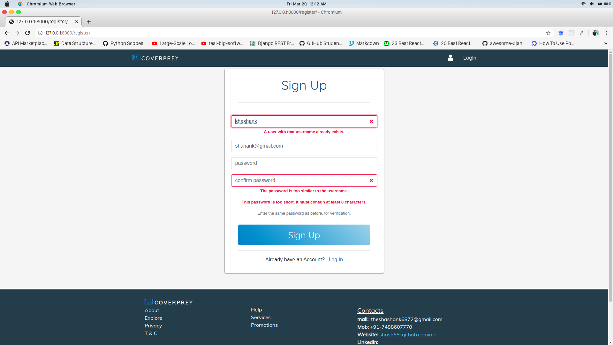

#### Login Page
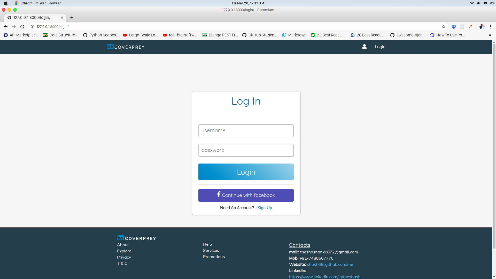

#### Posts List View
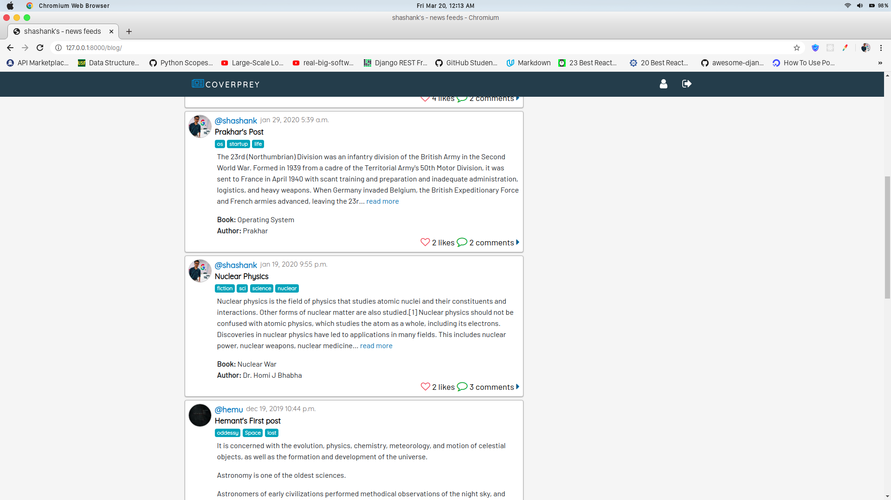

#### Search bar and Popular Tags
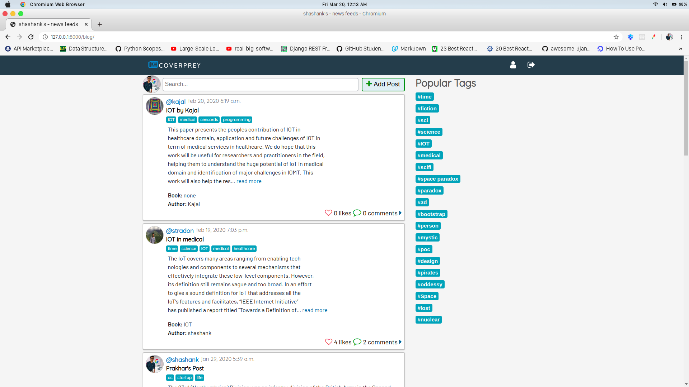

#### Typing in search bar
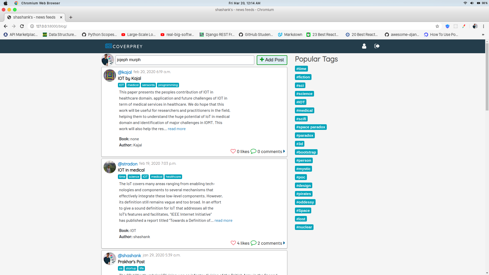

#### Results of search
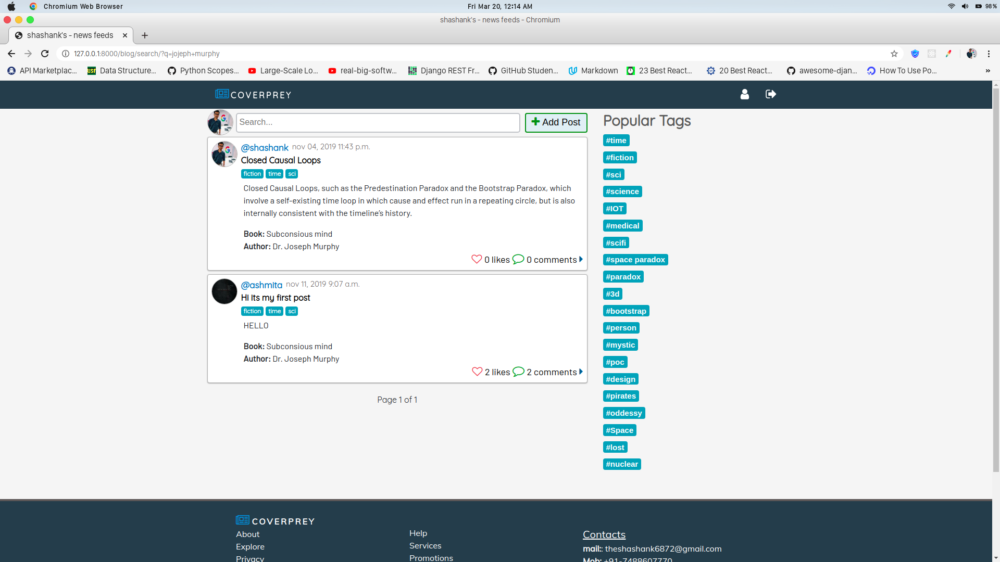

#### Post Create form
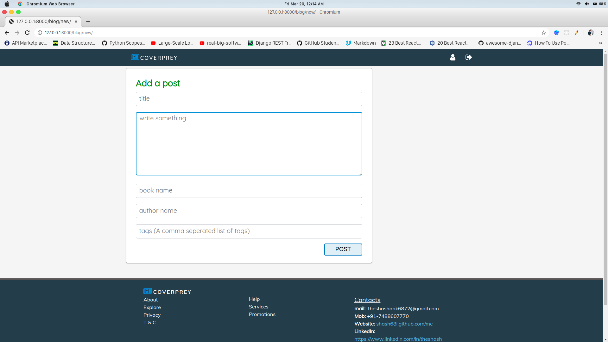

#### Form after data
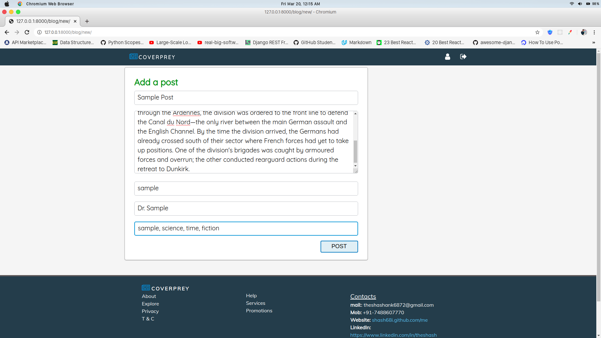

#### Post added at the top
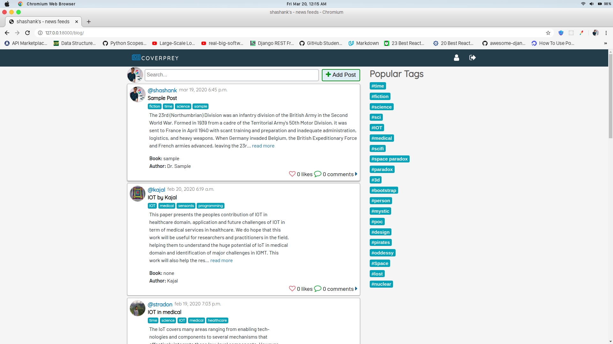

#### Getting posts with particular tags
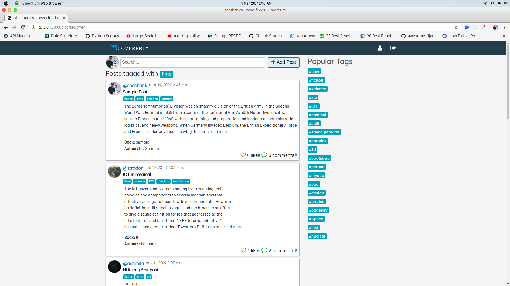

#### Another person profile page


#### Detail View with Likes comments and recommended posts
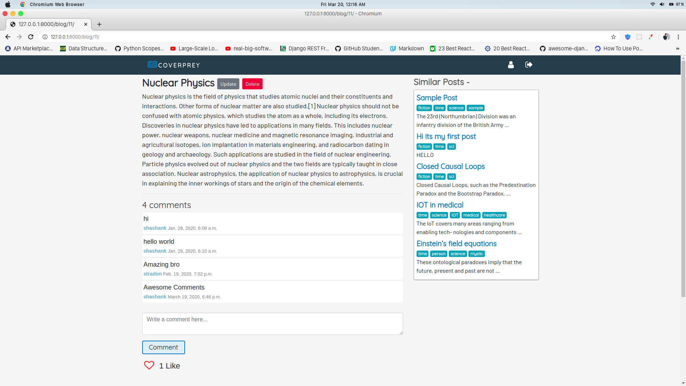

#### Like incremented


IF YOU COULD SETUP, IT"LL BE FUN TO PLAY AROUND.
Search feature will only work in Postgres database

&copy; shashank 2019